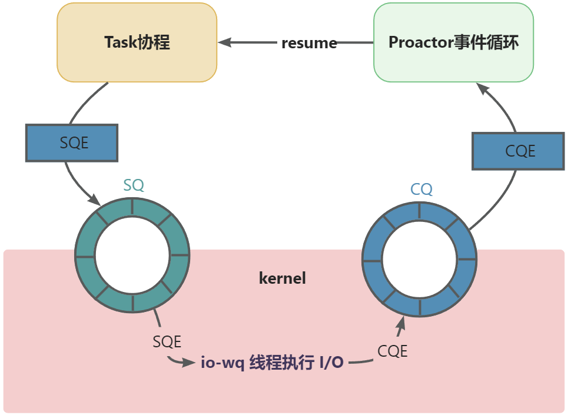

# couringserver
A web static resource server based on C++20 coroutine and asynchronous I/O framework io-uring.
## 项目介绍
### 概要
couringserver 是一个基于 C++ 20 Coroutine 协程和 Linux 内核最新异步 I/O 框架的简单多线程 HTTP 服务器，采用 Proactor模式设计，旨在探索 Linux 内核最新特性，不建议用于生产环境。
### 特性
* 使用 C++ 20 协程简化服务端与客户端的异步交互
* 使用 io_uring 管理异步 I/O 请求, 例如 `accept()`, `recv()`, `send()`, `splice()`
* 使用 ring-mapped buffers 减少内存分配的次数, 减少数据在内核态与用户态之间拷贝的次数 (Linux 5.19 新特性)
* 使用 multishot accept 减少向 io_uring 提交 `accept()` 请求的次数 (Linux 5.19 新特性)
* 实现线程池进行协程调度, 充分利用 CPU 的所有核心
* 使用 RAII 类管理 io_uring, 文件描述符, 以及线程池的生命周期
## 基本结构
Proactor模型中主要包括：
* Proactor：事件循环。根据 I/O 完成的 CQE 恢复对应的 Task 协程，继续进行业务处理。
* Task：协程负责某个完整的处理流程。例如，Acceptor 协程发起 `accept` 请求，等待完成后为客户端连接创建对应的 Handle 协程负责 HTTP 请求的处理，循环这个过程。Handle 协程发起 `recv` 请求，等待完成后解析 HTTP 请求，构建 HTTP 响应报文，通过 `send` 请求发送给客户端，如果请求的文件资源存在，将发起 `splice` 请求，等待完成后单次请求的响应完成，持续循环直到连接关闭。
* 内核 I/O：用户进程发起的 I/O 请求放入 SQ 队列提交，内核中的 `io-wq` 线程实现 I/O 的异步执行，完成后将完成结果放入 CQ 队列。

## 编译环境
* Linux Kernel 5.19 或更高版本（支持ring mapped buffers）
* GCC 13或更高版本
* liburing 2.3 或更高版本
## 构建
```
cmake -DCMAKE\_BUILD\_TYPE=Release -DCMAKE\_C\_COMPILER:FILEPATH=/usr/bin/gcc -DCMAKE\_CXX\_COMPILER:FILEPATH=/usr/bin/g++ -B build -G "Unix Makefiles"
make -C build -j$(nproc)
./build/couringserver
```
## 性能测试
使用[hey](https://github.com/rakyll/hey)工具测试 co-uring-http 在高并发情况的性能, 建立 1 万个客户端连接, 总共发送 100 万个 HTTP 请求, 每次请求大小为 1 KB 的文件. co-uring-http 每秒可以 88160 的请求, 并且在 0.5 秒内处理了 99% 的请求.

测试环境：WSL (Ubuntu 22.04 LTS, Kernel 版本 6.3.0-microsoft-standard-WSL2), i5-12400 (6 核 12 线程 ), 16 GB 内存, PM9A1 固态硬盘.

```
./hey -n 1000000 -c 10000 <http://127.0.0.1:8080/1k>

Summary:
  Total:        11.3429 secs
  Slowest:      1.2630 secs
  Fastest:      0.0000 secs
  Average:      0.0976 secs
  Requests/sec: 88160.9738

  Total data:   1024000000 bytes
  Size/request: 1024 bytes

Response time histogram:
  0.000 [1]     |
  0.126 [701093]|■■■■■■■■■■■■■■■■■■■■■■■■■■■■■■■■■■■■■■■■
  0.253 [259407]|■■■■■■■■■■■■■■■
  0.379 [24843] |■
  0.505 [4652]  |
  0.632 [678]   |
  0.758 [1933]  |
  0.884 [1715]  |
  1.010 [489]   |
  1.137 [5111]  |
  1.263 [78]    |
```

## 文档
### 组件简介
* `task` (`task.hpp`): `task` 类表示一个协程, 在被 `co_await` 之前不会启动.
* `thread_pool` (`thread_pool.hpp`): `thread_pool` 类实现了一个线程池来调度协程.
* `file_descriptor` (`file_descriptor.hpp`): `file_descriptor` 类持有一个文件描述符. `file_descriptor.hpp` 文件封装了一些支持 `file_descriptor` 类的系统调用，例如 `open()`、`pipe()` 与 `splice()`.
* `server_socket` (`socket.hpp`): `server_socket` 类扩展了 `file_descriptor` 类, 表示可接受客户端的监听套接字. 它提供了一个 `accept()` 方法, 记录是否在 io_uring 中存在现有的 `multishot accept` 请求，并在不存在时提交一个新的请求.
* `client_socket` (`socket.hpp`): `client_socket` 类扩展了 `file_descriptor` 类, 表示与客户端进行通信的套接字. 它提供了一个 `send()` 方法, 用于向 io_uring 提交一个 `send` 请求, 以及一个 `recv()` 方法, 用于向 `io_uring` 提交一个 `recv` 请求.
* `io_uring` (`io_uring.hpp`): `io_uring` 类是一个 `thread_local` 单例, 持有 `io_uring` 的提交队列与完成队列.
* `buffer_ring` (`buffer_ring.hpp`): `buffer_ring` 类是一个 `thread_local` 单例, 向 `io_uring` 提供一组固定大小的缓冲区. 当收到一个 HTTP 请求时, `io_uring` 从 `buffer_ring` 中选择一个缓冲区用于存放收到的数据. 当这组数据被处理完毕后, `buffer_ring` 会将缓冲区还给 `io_uring`, 允许缓冲区被重复使用. 缓冲区的数量与大小的常量定义于 `constant.hpp`, 可以根据 HTTP 服务器的预估工作负载进行调整.
* `http_server` (`http_server.hpp`): `http_server` 类为 `thread_pool` 中的每个线程创建一个 `thread_worker` 任务, 并等待这些任务执行完毕.
* `thread_worker` (`http_server.hpp`)：`thread_worker` 类提供了一些可以与客户端交互的协程. 它的构造函会启动 `thread_worker::accept_client()` 和 `thread_worker::event_loop()` 这两个协程.
  * `thread_worker::event_loop()` 协程在一个循环中处理 `io_uring` 的完成队列中的事件, 并继续运行等待该事件的协程.
  * `thread_worker::accept_client()` 协程在一个循环中通过调用 `server_socket::accept()` 来提交一个 `multishot accept` 请求到 io_uring. (由于 `multishot accept` 请求的持久性, `server_socket::accept()` 只有当之前的请求失效时才会提交新的请求到 io_uring.) 当新的客户端建立连接后, 它会启动 `thread_worker::handle_client()` 协程处理该客户端发来的 HTTP 请求.
  * `thread_worker::handle_client()` 协程调用 `client_socket::recv()` 来接收 HTTP 请求, 并且用 `http_parser` (`http_parser.hpp`) 解析 HTTP 请求. 等请求解析完毕后, 它会构造一个 `http_response` (`http_message.hpp`) 并调用 `client_socket::send()` 将响应发给客户端.

### 工作流程
1. `http_server` 为 `thread_pool` 中的每个线程创建一个 `thread_worker` 任务.
2. 每个 `thread_worker` 任务使用 `SO_REUSEPORT` 选项创建一个套接字来监听相同的端口, 并启动 `thread_worker::accept_client()` 与 `thread_worker::event_loop()` 协程.
3. 当新的客户端建立连接后, `thread_worker::accept_client()` 协程会启动 `thread_worker::handle_client()` 协程来处理该客户端的 HTTP 请求.
4. 当 `thread_worker::accept_client()` 或 `thread_worker::handle_client()` 协程等待异步 I/O 请求时, 它会暂停执行并向 io_uring 的提交队列提交请求, 然后把控制权还给 `thread_worker::event_loop()`.
5. `thread_worker::event_loop()` 处理 io_uring 的完成队列中的事件. 对于每个事件, 它会识别等待该事件的协程, 并恢复其执行.

## 鸣谢

- [co-uring-http](https://github.com/xiaoyang-sde/co-uring-http) 基于 C++20 协程和 io_uring 构建的高性能 HTTP 服务器
- [hey](https://github.com/rakyll/hey) HTTP 负载生成器，ApacheBench (ab) 替代
- [co_context](https://github.com/Codesire-Deng/co_context) 一个基于io_uring的针对高并发io且延迟合理的协程框架。
- [sheep](https://github.com/harveysuncn/sheep) 一个基于C++20协程和异步IO的网络框架
- [libcoring](https://github.com/rzbdz/libcoring) 一个使用 Proactor 模式基于 C++20 协程和 Linux 新的 io_uring 系统调用的 C++ 网络库
- [co_http_uring](https://github.com/overmighty/co_http_uring) 基于 C++20 协程和 Linux io_uring API 的 HTTP/1.1 服务器库
- [xynet](https://github.com/xuanyi-fu/xynet) 基于 C++20 协程和 io_uring 的网络库
## 版权信息
couringserver 遵循 MIT 许可证。有关详细信息请参见 LICENSE 文件。